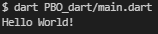
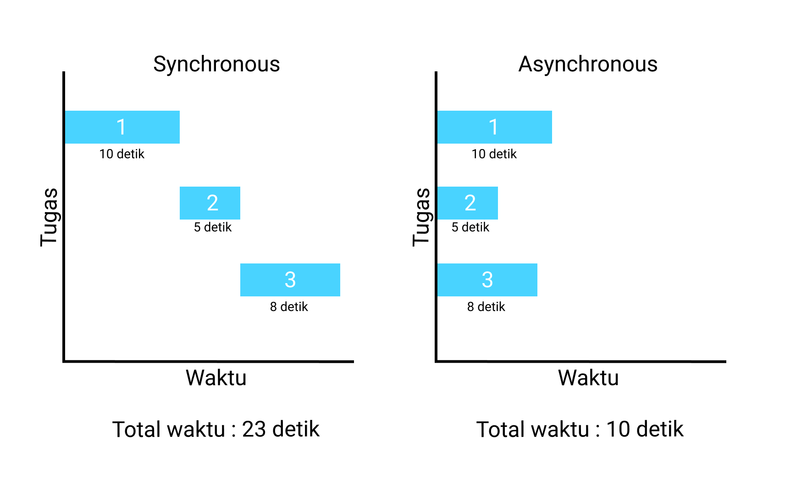

# PBO Dart

# Pendahuluan

Dart adalah bahasa yang dioptimalkan untuk klien mengembangkan suatu aplikasi dengan cepat dan berjalan di platform apapun(multi-platform). Framework pengembangan software yang menggunakan bahasa dart adalah framework flutter.

Selengkapnya : [https://dart.dev/overview](https://dart.dev/overview)

---

# Program Pertama

Buka Visual Studio Code, lalu buat file main.dart dan masukkan kode berikut.

```dart
void main() {
	print("Hello World!");
}
```

Buka terminal dan ketikan kode berikut :

> dart <file-name>

```bash
dart main.dart
```

Output :



Penjelasan :

```dart
void main () {}
```

Fungsi `main` adalah fungsi utama yang akan mengeksekusi semua kode yang ditulis didalamnya, maka biasanya satu program hanya memiliki satu fungsi `main`. Fungsi `main` menggunakan void karena tidak mengembalikan nilai apapun, melainkan hanya menampilkan apa yang ditulis kedalamnya.

```dart
print("Hello World!");
```

`print` merupakan fungsi bawaan dari dart yang akan menampilkan suatu output, dan menambahkan baris baru setelahnya mirip seperti `System.out.println()` pada bahasa java. Kita bisa menghindari pembuatan baris baru dengan menggunakan `stdout.write()`.

Selengkapnya tentang `stdout.write()` dan `stdin.readLineSync()`: [https://api.dart.dev/stable/2.15.1/dart-io/Stdout-class.html](https://api.dart.dev/stable/2.15.1/dart-io/Stdout-class.html)

> Jika kalian tidak menggunakan visual studio code, kalian bisa juga menggunakan website bawaan dari dart : [https://dartpad.dev/](https://dartpad.dev/)

> Atau bisa juga menggunakan software lain seperti IntelJIDEA : [https://www.jetbrains.com/idea/download/#section=windows](https://www.jetbrains.com/idea/download/#section=windows)

---

# Variables

Dart adalah bahasa yang mendukung penggunaan **type inference** yang mendukung variable dengan type data dynamic dengan deklarasi `var`. Contoh :

```dart
void main() {
  var name = 'Budi';

  print(name);
}

// Output:
// Budi
```

## Late variables

Dart 2.12 menambahkan `late` modifier, yang memiliki dua kasus penggunaan :

- Mendeklarasikan variabel non-nullable yang diinisialisasi setelah deklarasi.
- Lazily initializing a variable.

Contoh :

```dart
late String name;

void main() {
  name = "Budi";

  print("Halo $name!");
}

// Output:
// Halo Budi!
```

## Constant dan final

Constant dan final digunakan untuk deklarasi variable yang tidak akan berubah selama program berjalan.

### Constant

constant menggunakan type inference untuk menentukan type datanya. Nilai const harus sudah diketahui dari sebelum program dijalankan dan tidak akan berubah nilainya selama program berjalan. Contoh :

```dart
void main() {
	const pi = 3.14; // const harus langsung diinisialisasi

	print(phi);
}

// Output :
// 3.14
```

### Final

final juga menggukanan type inference dan nilai dari suatu variable masih bisa dirubah selama belum dinisialisasi. Contoh :

```dart
import 'dart:io';

void main() {
  stdout.write("Masukkan tempat tinggal : ");
  final place = stdin.readLineSync(); // Menerima input dari user

  print("Tempat tinggal anda di $place");
}

// Output :
// Masukkan tempat tinggal : Depok
// Tempat tinggal anda di Depok
```

---

# Built-in types

Dart juga mendukung _statically typed_, yaitu ketika variable atau fungsi dideklarasikan, tipe data harus dituliskan juga. Berikut tipe data yang dimiliki oleh dart :

- [Numbers(int, double)](PBO%20Dart%201fe752b88fc44dc986c1cc70db7cf687.md)
- [Strings(String)](PBO%20Dart%201fe752b88fc44dc986c1cc70db7cf687.md)
- [Booleans(bool)](PBO%20Dart%201fe752b88fc44dc986c1cc70db7cf687.md)
- [Lists(List)](PBO%20Dart%201fe752b88fc44dc986c1cc70db7cf687.md)
- [Set(Set)](PBO%20Dart%201fe752b88fc44dc986c1cc70db7cf687.md)
- [Maps(Map)](PBO%20Dart%201fe752b88fc44dc986c1cc70db7cf687.md)

## Numbers(int, double)

### int

Int memiliki nilai bilangan bulat

```dart
void main() {
  var x = 1;
  var hex = 0xDEADBEEF;

  print(x);
  print(hex);
}

// output :
// 1
// 3735928559
```

### double

Double memiliki nilai bilangan desimal

```dart
void main() {
  var y = 1.1;
  var exponents = 1.42e5;

  print(y);
  print(exponents);
}

// output :
// 1.1
// 142000.0
```

## Strings(String)

Ada beberapa cara penulisan string value, seperti berikut :

```dart
void main() {
  var s1 = 'Single quotes work well for string literals.';
  var s2 = "Double quotes work just as well.";
  var s3 = 'It\'s easy to escape the string delimiter.';
  var s4 = "It's even easier to use the other delimiter.";

  print(s1);
  print(s2);
  print(s3);
  print(s4);
}

// Output:
// Single quotes work well for string literals.
// Double quotes work just as well.
// It's easy to escape the string delimiter.
// It's even easier to use the other delimiter.
```

## Booleans(bool)

Boolean memiliki dua nilai, yaitu `true` dan `false`

```dart
void main() {
  var fullName = '';

  if (fullName.isEmpty) {
    print(true);
  } else {
    print(false);
  }
}

// Output:
// true
```

## Lists(List)

List memiliki kumpulan nilai berurutan yang dibungkus jadi satu didalam sebuah nilai. List merupakan bagian dari collection dart.

```dart
void main() {
  var list = ['Car', 'Boat', 'Plane'];

  list.add('Train'); // add element
  list[0] = 'Bus'; // update element
  list.remove('Plane'); // delete element

  print(list);
}

// Output:
// [Bus, Boat, Train]
```

### Spread operator

Spread memungkinkan untuk menambahkan beberapa nilai sekaligus kedalam sebuah koleksi(collection).

```dart
void main() {
  var list = [1, 2, 3];
  var list2 = [0, ...list];

  print(list2);
}

// Output:
// [0, 1, 2, 3]
```

### Collection if

```dart
void main() {
  bool promoActive = true;
  var nav = ['Home', 'Furniture', 'Plants', if (promoActive) 'Outlet'];

  print(nav);
}

// Output:
// [Home, Furniture, Plants, Outlet]
```

### Collection for

```dart
void main() {
  var listOfInts = [1, 2, 3];
  var listOfStrings = ['0', for (var i in listOfInts) '$i']; // listOfInts convert to String

  print(listOfStrings);
}

// Output:
// [0, 1, 2, 3]
```

## Set(Set)

Set adalah koleksi dari item unik yang tidak berurutan. Set juga termasuk kedalam collection dart.

```dart
void main() {
  var halogens = {'fluorine', 'chlorine', 'bromine', 'iodine', 'astatine'};

  var elements = <String>{};
  elements.add('fluorine'); // add one element
  elements.addAll(halogens); // add all elements from halogens

  // update element with map to set
  halogens = halogens
      .map((item) => (item == 'chlorine') ? 'chlorineUpdate' : item)
      .toSet();

  halogens.remove('bromine'); // delete element

  print(halogens);
}

// Output:
// {fluorine, chlorineUpdate, iodine, astatine}
```

## Maps(Map)

Map adalah object yang diasosiasi dengan pasangan key dan value.

```dart
void main() {
  var gifts = {
    // Key:    Value
    'first': 'partridge',
    'second': 'turtledoves',
    'fifth': 'golden rings'
  };

  gifts['fourth'] = 'calling birds'; // add element
  gifts['first'] = 'partridge 2'; // update element
  gifts.remove('second'); // remove element

  print(gifts);
}

// Output:
// {first: 'partridge 2', fifth: 'golden rings', fourth: 'calling birds'}
```

---

# Function

Fungsi digunakan untuk kebutuhan _reusable_ berdasar input(parameter) tertentu yang disesuaikan dengan implementasinya. Fungsi-fungsi lain akan dipanggil didalam fungsi `main`. Berikut adalah contoh dari penerapan fungsi :

```dart
void main() {
	getName();
}

void getName() {
  print('Budi');
}

// Output:
// Budi
```

## Parameters

Parameter digunakan untuk menampung suatu nilai dari pemanggilannya ataupun dari dirinya sendiri. Jalankan baris kode berikut :

```dart
void main() {
	getName('Budi');
}

void getName(String name) {
  print(name);
}
```

Kita bisa juga mengembalikan nilai yang hendak kita `print` di fungsi `main` dengan `return`.

```dart
void main() {
  print(getName('Budi'));
}

String getName(String name) {
  return name;
}
```

### Named parameter

```dart
void main() {
  enableFlag(hidden: true);
}

void enableFlag({bool? hidden}) {
  print(hidden);
}

// Output:
// true
```

> Selain type data pada variable, type data pada function yang merujuk pada nilai kembalian juga bisa menggunakan null safety yang ditandai penggunaan tanda tanya( ? ).

### **Optional positional parameters**

```dart
void main() {
  var sayHai = say("Budi", "hai", "carrier pigeon");

  print(sayHai);
}

String say(String from, String msg, [String? device]) {
  var result = '$from says $msg';
  if (device != null) {
    result = '$result with a $device';
  }
  return result;
}

// Output:
// Budi says hai with a carrier pigeon
```

### Default parameter

Default parameter bisa digunakan di named paremeter dan optional positional parameter.

```dart
void main() {
  var sayHai = say("Budi", "hai", "Mobile phone");

  enableFlag(hidden: true);
  print(sayHai);
}

void enableFlag({bool hidden = false}) {
  print(hidden);
}

String say(String from, String msg, [String device = 'carrier pigeon']) {
  var result = '$from says $msg with a $device';
  return result;
}

// Output:
// true
// Budi says hai with a carrier pigeon
```

---

# Operator

[Arithmetic operators](PBO%20Dart%201fe752b88fc44dc986c1cc70db7cf687/Arithmetic%20operators%20968fe25c04a845e28a4634f0388e1d57.csv)

Contoh :

```dart
void main() {
  int x = 1;
  int y = 2;
  int penjumlahan = x + y;
  int pengurangan = y - x;

  print("Hasil dari penjumlahan $x dan $y = " + penjumlahan.toString());
  print("Hasil dari pengurangan $y dan $x adalah $pengurangan");
}

// Output:
// Hasil dari penjumlahan 1 dan 2 = 3
// Hasil dari pengurangan 2 dan 1 adalah 1
```

Penjelasan :

```dart
int penjumlahan = x + y;
int pengurangan = y - x;
```

penjumlahan memiliki nilai dari x dan y

```dart
print("Hasil dari penjumlahan $x dan $y = " + penjumlahan.toString());
print("Hasil dari pengurangan $y dan $x adalah $pengurangan");
```

- `print`berisi String yang memiliki concatenation dengan nilai dari x, y, penjumlahan dan pengurangan
- `$x, $y, $pengurangan` digunakan untuk memanggil value dari variable yang dimasukkan langsung dalam `String` dan otomatis di konversi menjadi nilai `String`, ini dinamakan String interpolation.
- Berbeda dengan `penjumlahan.toString()` yang menggunakan method atau fungsi bawaan dart, yaitu `toString()` untuk mengkonversinya menjadi nilai `String`

[Equality and relational operators](PBO%20Dart%201fe752b88fc44dc986c1cc70db7cf687/Equality%20and%20relational%20operators%2075760c11b3f74bab9cf0842f7f4083d7.csv)

[Logical operators](PBO%20Dart%201fe752b88fc44dc986c1cc70db7cf687/Logical%20operators%206f2c9ad969f54eb89debeb0971764fc3.csv)

## Conditional expressions

Kondisi ini digunakan untuk meringkas penggunaan `if` dan `else`

> condition ? true : false

```dart
var visibility = isPublic ? 'public' : 'private';
```

- Jika `isPublic` true, maka variable visibility memiliki nilai `‘public’` tetapi jika `isPublic` false, maka visibility memiliki nilai `‘private’`

```dart
String playerName(String? name) => name ?? 'Guest';
```

- Jika `String? name` null, maka `name` akan memiliki nilai ‘Guest’

## Cascade notations

Notasi ini memungkinkan kitauntuk membuat urutan operasi pada objek yang sama.

Dari pada kita menulis kode seperti ini :

```dart
var paint = Paint();
paint.color = Colors.black;
paint.strokeCap = StrokeCap.round;
paint.strokeWidth = 5.0;
```

Lebih baik kita tuliskan seperti ini :

```dart
var paint = Paint()
  ..color = Colors.black
  ..strokeCap = StrokeCap.round
  ..strokeWidth = 5.0;
```

---

# Control flow statements

## If and else

Digunakan untuk mengecek suatu nilai apakah memenuhi suatu kondisi tertentu.

```dart
void main() {
	int x = 10;

	if (x >= 10) {
		print("Lulus");
	} else {
		print("Tidak Lulus");
	}
}

// Output:
// Lulus
```

Penjelasan :

```dart
if (x >= 10) {
		print("Lulus");
}
```

`x` mempunyai nilai 10, `if` mengecek apakah `x >= 10` jika kondisi terpenuhi, maka akan menampilkan output `Benar`

Jika kondisi `if` tidak terpenuhi, maka `else` akan ditampilkan.

Untuk mengecek beberapa kondisi gunakan `else if` :

```dart
void main() {
	int x = 9;

	if (x >= 10) {
		print("Lulus");
	} else if (x < 10) {
		print("Tidak Lulus");
	} else {
		print("Nilai tidak ditemukan");
	}
}

// Output:
// Tidak Lulus
```

Penjelasan :

```dart
else if (x < 10) {
	print("Tidak Lulus");
}
```

`else if` digunakan untuk membuat kondisi kedua, yaitu ketika `x < 10`.

## For loops

`for` digunakan untuk mengulang sebanyak apa nilai tertentu dapat ditampilkan. Jika dibandingkan dengan cara manual, yaitu ditulis satu-satu seperti ini :

```dart
void main() {
	print(1);
	print(2);
	print(3);
}

// Output:
// 1
// 2
// 3
```

Contoh diatas mungkin masih bisa kita tulis dengan manual, tapi misalkan terdapat 100 atau bahkan 1000 baris data yang harus di `print`. Tentunya akan memakan banyak waktu dan kode menjadi tidak efisien.

Bisa kita sederhanakan menggunakan `for` menjadi seperti ini :

```dart
void main() {
	for (int i = 1;i <= 3; i++) {
	  print(i);
  }
}

// Output:
// 1
// 2
// 3
```

Penjelasan :

- `int i = 1` digunakan untuk batas atau nilai awal
- `i <= 3` digunakan untuk batas akhir dari perulangan
- `i++` menandakan perulangan beranjak naik +1, sama saja dengan `i = i + 1` atau `i += 1`

## While and do-while

### While

Perulangan `while` kurang lebih sama, tujuannya yaitu untuk mengulang sebanyak apa suatu data bisa di tampilkan. Jalankan kode berikut :

```dart
void main() {
	int i = 1;

  while (i <= 3) {
	  print(i);
	  i++;
  }
}

// Output:
// 1
// 2
// 3
```

### Do-while

Bentuk lain dari `while` adalah do-while yang dimana do-while sendiri akan menjalankan kodenya dulu setidaknya sekali baru di cek apakah kondisi di dalam `while` terpenuhi atau tidak. Jalankan kode berikut :

```dart
void main() {
  int i = 0;

  do {
    print(i);
    i++;
  } while (i <= 3);
}

// Output:
// 0
// 1
// 2
// 3
```

## Break and continue

### Break

Break digunakan untuk memberhentikan suatu perulangan(atau proses tertentu)

```dart
void main() {
  int counter = 0;

  while (counter <= 10) {
    counter++;
    if (counter == 5) break; // counter = 5 dihentikan

    print(counter);
  }
}

// Output:
// 1
// 2
// 3
// 4
```

### Continue

Continue digunakan untuk men-skip suatu nilai pada perulangan

```dart
void main() {
  int counter = 0;

  while (counter < 5) {
    counter++;
    if (counter == 3) {
      // counter = 3 di skip
      continue;
    }

    print(counter);
  }
}

// Output:
// 1
// 2
// 4
// 5
```

## Switch case

`switch case` digunakan untuk mengecek suatu variable atau nilai tertentu apakah sesuai dengan `case` yang ada. Jalankan kode berikut :

```dart
void main() {
  String hari = "minggu";

  switch (hari) {
    case "senin":
      {
        print("Ini hari senin");
      }
      break;

    case "selasa":
      {
        print("Ini hari selasa");
      }
      break;

    case "rabu":
      {
        print("Ini hari rabu");
      }
      break;

    case "kamis":
      {
        print("Ini hari kamis");
      }
      break;

    case "jumat":
      {
        print("Ini hari jumat");
      }
      break;

    case "sabtu":
      {
        print("Ini hari sabtu");
      }
      break;

    case "minggu":
      {
        print("Ini hari minggu");
      }
      break;

    default:
      {
        print('Tidak ada hari $hari');
      }
      break;
  }
}

// Output:
// Ini hari minggu
```

Penjelasan :

- `String hari = "minggu"` adalah nilai yang akan di cek
- `switch (hari) {}` memulai pengecekan nilai
- `case “senin”` nilai dari variable di cek apakah sesuai dengan case yang ada
- `print("Ini hari senin")` nilai akan ditampilkan jika suatu kondisi pengecekan terpenuhi
- `break` digunakan untuk melanjutkan ke blok case selanjutnya
- `default` adalah blok optional ketika semua case tidak terpenuhi

---

# Null Safety

Null safety hadir dalam pada dart versi 2.12.0 yang membolehkan suatu variable bernilai kosong atau `null`. Null safety hadir untuk menghindari kesalahan program, yaitu Null Pointer Exception(NPE). Berikut perbandingannya :

```dart
void main() {
	int number;

	print(number);
}
```

Kode diatas akan memberikan tanda peringatan kalau nilai dari variable number tidak boleh `null` dan harus diisi oleh suatu nilai sebelum digunakan.


Sebaliknya jika kita tulis seperti ini :

```dart
void main() {
	int? number; // nilai implisit
	int? numberNull = null; // bisa juga ditulis eksplisit seperti ini

	print(number);
	print(numberNull);
}

// Output:
// null
// null
```

Selengkapnya seputar null safety : [https://dart.dev/null-safety](https://dart.dev/null-safety)

---

# OOP (Object Oriented Programming)

## Class

Class merupakan sebuah cetak biru(blueprint) yang berisi attribut dan kebiasaan(behaviour) dari suatu objek. Contoh :

```dart
class Person {
  String name = '';
  int nim = 0;

  Person(this.name, this.nim); // constructor

  void student() { // method student
    print('Nama\t: $name');
    print('NIM\t: $nim');
  }
}

void main() {
  var person = Person('Budi', 911041241); // object

  person.student(); // method student dipanggil melalui object
}

// Output:
// Nama    : Budi
// NIM     : 911041241
```

## Properties

Dart tidak memiliki access modifier seperti di bahasa java, baik itu access modifier di class, function(method) ataupun di variable. Akan tetapi, variable di dart bisa menambahkan tanda underscore( \_ ) sebagai penanda itu adalah _private_, seperti pada kode berikut :

```dart
String name = '';
int nim = 0;
```

## Methods

Method adalah fungsi yang berada di dalam class. Method berisi perilaku dari suatu objek. Seperti pada method `student()` yang digunakan untuk mencetak `name` dan `nim`.

```dart
// method student
void student() {
	print('Nama\t: $name');
  print('NIM\t: $nim');
}
```

## Constructor

Constructor merupakan method yang akan memberikan nilai awal pada saat objek dibuat.

```dart
class Person {
	String name = '';
	int nim = 0;

	Person(this.name, this.nim);
}
```

Penjelasan :

- Nama method harus sama dengan nama `class` dan diawali dengan huruf besar seperti `class`
- Keyword `this` merujuk pada instance saat ini, yaitu Person
- Constructor tidak memiliki nilai `return`

## Inheritance

Inheritance adalah konsep pewarisan dari suatu `class` yang menurunkan property dan methodnya ke `class` lain. class turunan disebut dengan _subclass_ dan `class` yang menurunkan disebut _superclass_.

Buat file parent.dart dan masukan kode berikut :

```dart
class Parent {
  String _name = '';
  String _latin = '';

  Parent(this._name, this._latin);

  String get name => _name;
  String get latin => _latin;
}
```

Buat file sub.dart dan masukkan kode berikut :

```dart
import 'parent.dart'; // import class Parent

class Sub extends Parent {
  String familyName = '';

  Sub(String name, String latin, String familyName) : super(name, latin) {
    this.familyName = familyName;
  }

  void printOutPlant() {
    print(
        'Nama latin dari $name adalah $latin dan $name dari keluarga $familyName');
  }
}
```

Buat file main.dart, masukkan dan jalankan kode berikut :

```dart
import 'sub.dart'; // import class sub

void main() {
  var sub = Sub('Pisang', 'Musa', 'Musaceae');

  sub.printOutPlant();
}

// Output:
// Nama latin dari Pisang adalah Musa dan Pisang dari keluarga Musaceae
```

## Abstraction

Abstract tidak bisa dipanggil menjadi object. Abstract digunakan untuk membuat interface dan juga dengan implementasinya.

```dart
abstract class Describable {
  void describe();

  void describeWithEmphasis() {
    print('=========');
    describe();
    print('=========');
  }
}

// implementasi dari Describable
class Person implements Describable {
  final String _name;

  Person(this._name);

  @override
  void describe() {
    print('I am $_name.');
  }

  @override
  void describeWithEmphasis() {
    print('=========');
    describe();
    print('=========');
  }
}

void main() {
  Person person = Person('Budi');
  person.describeWithEmphasis();
}
```

## Implicit Interface

Setiap `class` dalam dart secara implisit mendefinisikan interface yang berisikan semua anggota instance `class` dan interface apa pun yang diimplementasikannya.

```dart
class Person {
  final String _name;

  Person(this._name);

  String greet(String who) => 'Hello, $who. I am $_name.';
}

// implementasi dari Person
class Impostor implements Person {
  @override
  String get _name => '';

  @override
  String greet(String who) => 'Hi $who. Do you know who I am?';
}

String greetBob(Person person) => person.greet('Bob');

void main() {
  print(greetBob(Person('Kathy')));
  print(greetBob(Impostor()));
}
```

## Enumeration

Enum adalah jenis `class` khusus yang digunakan untuk mewakili sejumlah nilai konstanta yang tetap. Jalankan kode berikut :

```dart
enum alphabet { A, B, C }

void main() {
  print(alphabet.values);
}
```

## Mixin

Mixin adalah cara menggunakan kembali kode kelas dalam beberapa hierarki kelas. Konsep yang digunakan oleh mixin adalah tumpukan(stack), sehingga nilai yang akan dimuncul kan adalah nilai yang berada pada tumpukan paling atas.

```dart
abstract class Performer {
  void entertaintMe();
}

mixin PlayPiano implements Performer {
  @override
  void entertaintMe() {
    print('playing piano');
  }
}

mixin PlayGuitar implements Performer {
  @override
  void entertaintMe() {
    print('playing guitar');
  }
}

class Musician extends Performer with PlayPiano, PlayGuitar {
  void show() {
    entertaintMe();
  }
}

void main() {
  var musician = Musician();

  musician.show();
}

// Output:
// playing guitar
```

---

# Dart Future

Dart future digunakan untuk operasi yang bersifat Asynchronous. Berikut adalah diagram ilustrasi perbedaan synchronous dan asynchronous :



Jalankan kode berikut :

```dart
Future<String> createOrderMessage() async {
  var order = await fetchUserOrder();
  return 'Your order is: $order';
}

Future<String> fetchUserOrder() =>
    Future.delayed(
      const Duration(seconds: 5),
      () => 'Coffe Latte',
    );

Future<void> main() async {
  print('Fetching user order...');
  print(await createOrderMessage());
}

// Output:
// Fetching user order...
// Your order is: Coffe Latte
```

Penjelasan :

- Method fetchUserOrder() digunakan untuk mendapatkan pesanan dari user
- Method createOrderMessage() digunakan untuk memproses pesanan dari user

---

# Daftar Pustaka

Type Inferences, [https://dart.dev/guides/language/type-system#type-inference](https://dart.dev/guides/language/type-system#type-inference)

Language Tour, [https://dart.dev/guides/language/language-tour](https://dart.dev/guides/language/language-tour)

# Credit

- GDSC STT NF
